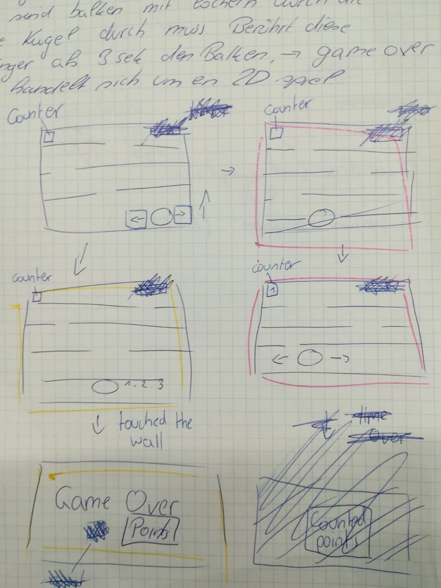
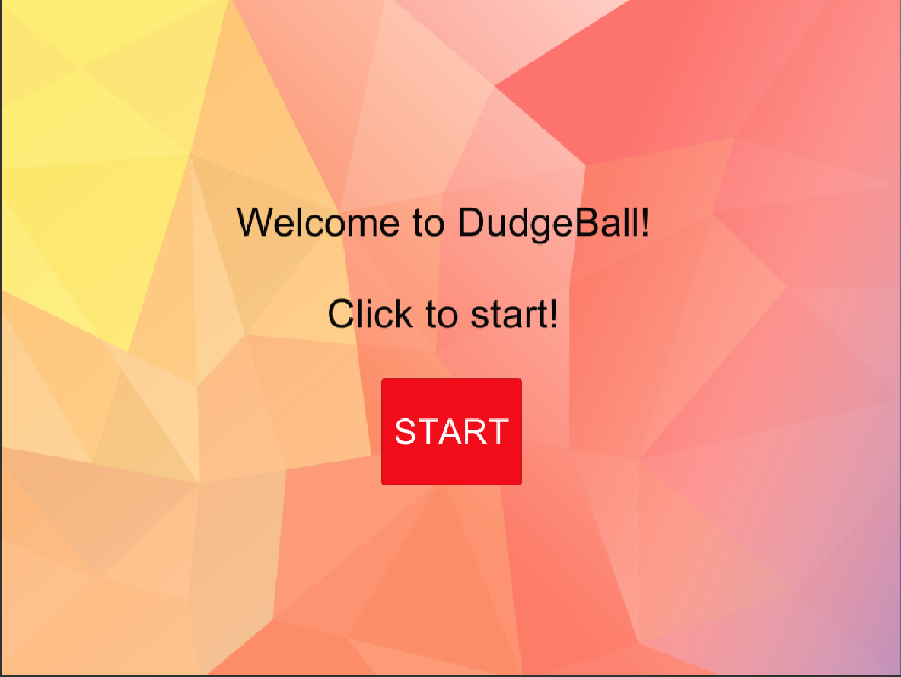
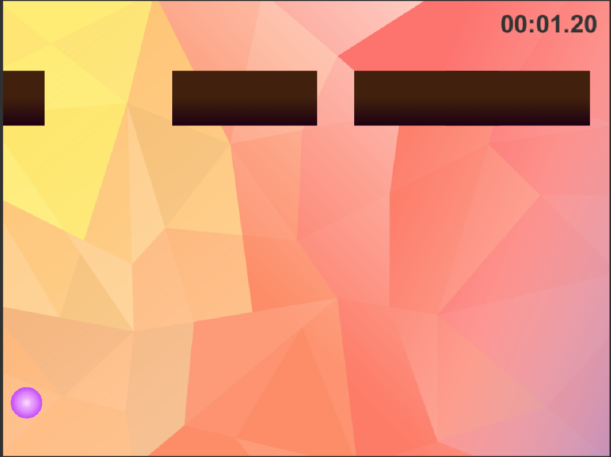
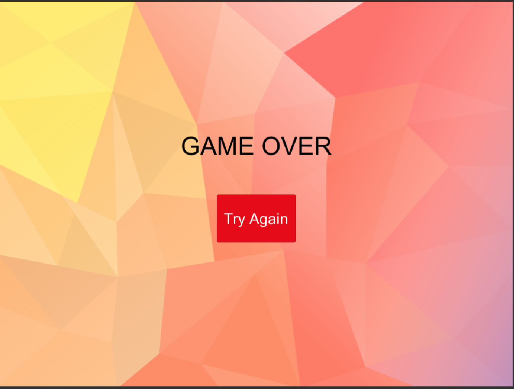

#DodgeBall

*DodgeBall - What's it about?
Goal of the game is to avoid collision with moving a ball, entering the screen from the top down to the bottom. The player is able to move left and right. DodgeBall is a game developed with Unity and build for desktop. It's a 2D game. 

*Screenshots
-Concept

-Welcome Scene

-Main Scene

-GameOver Scene

*Runtime Version: .NET 3.5 Equivalent
*API Level_  .NET 2.0 Subseta

*Development Platform
-macOS Mojave version 10.14
-Unity 2018.2.19f1
-VS 7.7.0.1868

*Target Platform
-pc Standalone (1024x768)

*Trailer
"https://youtu.be/MSdy6Ck-Knw"

*Progress (95% Done)
- User interface
- Generate world (random)
- Add stopwatch
- Player interaction with world (collisions etc.)

*Scripts
-Parallaxer Script: inspired by Valerian TSCHOPP

*Limitations
- you can't see your reached time on the "Game Over" Screen.
- no counter

*Lessons Learned
Control with arrow keys, C # Basics, create 2D scenes, create buttons, program time counters, spawn objects

Copyright Carolin Hollweger

